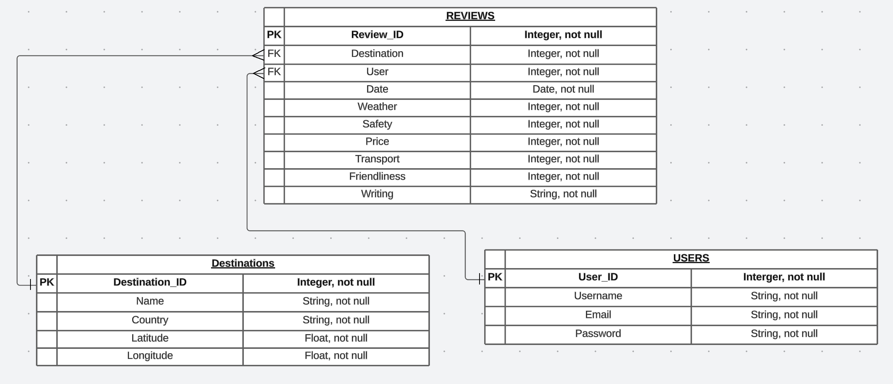

# T2A2 Assignment

## Important links

[Trello board](https://trello.com/b/6n9zVN8J/t2a2-flask-project)

[Github link](https://github.com/ausraf720/T2A2)

## Instructions on how to set up application:

Provided is a sample .env file, but a personal postgresql uri and jwt secret key must be provided for the application to work.

When setting up application, make sure to install the [Requirements](./src/requirements.txt). Below is a process of running the application using python venv in the terminal (this was done on MAC):

`python3 -m venv .venv`

`source .venv/bin/activate`

`pip install -r requirements.txt`

In order to create tables, run:

`flask db create`

Populate the tables with:

`flask db seed`

Run server with:

`flask run`

Optionally, tables can then be removed at end with:

`flask db drop`

Then run this in the terminal to exit the venv:

`deactivate`

## R1

This app is designed to allow travellers to post reviews and scores on travel destinations, which can help other travellers see the average rating for destinations they’re considering travelling to, and make a more informed decision. However, each review gives more than just one singular score per destination. Each destination gets a score of 1 - 5 for a number of categories: 
* Friendliness
* Price
* Safety
* Transport
* Weather 

When having multiple categories arranged this way, users can see if a travel destination scores highly in a category that matters to them. For example, some users are travelling on a budget, so seeing a place that has a low ‘price’ rating will stick out to them and be more desirable. Others might be concerned about safety, so anywhere with a high average ‘safety’ rating will immediately become more desirable, etc. 

## R2

This app solves a problem that occurs with many review-based applications and databases, including existing travel apps. 

[Tripadvisor](https://www.tripadvisor.com.au/) is a popular and similar application, but unlike this new travel app design, it doesn’t have different categories like ‘safety’, ‘friendliness’, etc. Instead it has a single rating for a place, which doesn’t convey a lot of information. Of course, someone can read the individual reviews for a destination if they wanted to get an idea of how safe a place was. However, this takes a lot of time and effort, and gives a very limited perspective when they only end up reading a few reviews out of potentially thousands of reviews. Having different categories allows each destination to have an average score for each category, and thus convey more information very quickly. Therefore, regarding the safety example, they can easily check the ‘safety’ average score in the new app design and get an idea of the destination’s safety level very quickly, rather than having to do lots of extra research.

This type of application can be applied to different domains too. For instance, [IMDB](https://www.imdb.com/) is popular for movies and giving a score of that movie, but that doesn’t give much information again. Some people care about the story and characters of a movie, but not at all about special effects and soundtrack, whereas other watchers may be the reverse. Having various categories that each give an average score for a movie can better convey more information quickly, such that people who want movies with good stories can filter them by those having a high average story score, etc. as seen above with the travel app.

## R3

Resources used:
* [Krasimir Hristozov, 2019, MySQL vs PostgreSQL](https://developer.okta.com/blog/2019/07/19/mysql-vs-postgres)
* [Hitesh Jethva, 2023, MySQL vs PostgreSQL](https://cloudinfrastructureservices.co.uk/mysql-vs-postgresql/)
* [fauna, 2020, What is ACID Compliance?](https://fauna.com/blog/what-is-acid-compliance-atomicity-consistency-isolation)

The main database system chosen for this project is the PostgreSQL relational database management system. Firstly, a relational database system is chosen, as the app described above involves relationships between different data objects, such as relationships between travel destinations, and associated reviews of that destination. Therefore, having a database management system that can handle these relationships is imperative. Additionally, PostgreSQL is also an object-relational database system, meaning it has features similar to those in object-oriented programming languages, such as table inheritance.

PostgreSQL has a number of advantages and disadvantages in comparison to other relational database management systems. 

### Advantages:

* PostgreSQL is free and open-source. This is perfect for junior web-developers who are building smaller applications, such as this one, and need a free and easily accessible database system where they can improve their skills and begin to demonstrate their abilities without any cost. 

* PostgreSQL is also very old and thus well-established in terms of SQL-based database systems, and has lots of functionality, more-so than something such as the more popular MySQL. PostgreSQL supports and is compatible with all SQL features, unlike MySQL, so it’s advantageous for developers who need the full power of SQL.

* PostgreSQL is fully ACID (Atomicity, Consistency, Isolation, and Durability) compliant, compared to MySQL which is only partially ACID compliant. In general terms, this means PostgreSQL’s database transactions are ensured to be highly reliable and correct, which is advantageous to any developer.

### Disadvantages:

* PostgreSQL’s open-source nature also serves as a disadvantage. It is not owned by a particular organisation, instead maintained by its own community. This means it’s unable to gain the popularity of a database system such as MySQL, which is owned by Oracle. PostgreSQL’s lack of popularity then leads it on to not having as much third-party support, and thus less external libraries.

* PostgreSQL can’t do read operations as fast as MySQL, meaning any GET requests in the API may have actually been faster if MySQL were used. However, PostgreSQL makes up for this by having faster writing times. Nowadays, both systems are highly optimised and the speed differences are probably negligible for smaller applications.

Overall, PostgreSQL’s compatibility with Python Flask and SQAlchemy, as well as it being free to use, are valid enough reasons for it to be used as the database systems as its drawbacks don’t really hinder its usefulness for smaller applications.

## R4

Resources used: 
* [Ihechikara Vincent Abba, 2022, What is an ORM](https://www.freecodecamp.org/news/what-is-an-orm-the-meaning-of-object-relational-mapping-database-tools/)
* [Rahul Awati, 2023, object-relational mapping (ORM)](https://www.theserverside.com/definition/object-relational-mapping-ORM)
* [W3Schools, 2023, SQL Injection](https://www.w3schools.com/sql/sql_injection.asp)

### Functionality of ORM:

ORM (Object Relational Mapping) can be thought of building a bridge from a database system to an object-oriented program, such as one written in Python or Java.

Many programs require use of a database to store their data, and usually those databases come with a DBMS (database management system) in the language of SQL. SQL allows for direct operations on the database, but not only is this different to the language used for the program, it means the application needs to communicate with SQL, which then communicates with the database, complicating development. ORM tools however are usually some sort of library or package that exists for a programming language, like SQLAlchemy for Python, and these tools allow database operations to be coded directly into the application’s files in the programming language of that application. 

The ORM functions by building a map that can translate objects from the object-oriented language to tables to the database, and how those objects relate to those tables. It then handles the logic required for interacting with the database. They can also handle in changes to the API or database without developers needing to change any code in their applications that depend on the data source. ORMs can also sanitise inputs to prevent SQL injection attacks. 

### Benefits of ORM:

ORM tools simplify the development process, as developers can code all of the app’s necessary database operations right into their app files, rather than needing a separate file for SQL commands that they need to link to. This means less code needs to be written, meaning development costs and times are reduced greatly. ORM's also come with other advantages. Development time is again reduced due to the fact that the ORM  handles changes to the database/API the application is accessing, meaning that when a change happens, the developer doesn't need to make changes to the code to adapt to the change. 

Another major advantage is that they improve security by preventing any SQL injection attacks. If pure SQL is used, hackers can potentially exploit this by using 'SQL injections' to input in SQL commands into the database to obtain sensitive data. ORMs however use sanitisation to prevent this, without the developer to coding in the sanitisation methods themselves which would take more time and be riskier. Overall, using an ORM is then more secure than using just loading in SQL code.
 

However, ORM's aren't without drawbacks. Firstly ORM's may not have the full power of SQL and not be able to handle complex SQL queries. Using an ORM will also potentially be slower than pure SQL. Lastly, even though the developer might not need to learn SQL fully to code database operations, which is a potential advantage in itself, they need to learn the ORM which is still time-consuming in itself. However, although these drawbacks can complicate things when complex SQL is involved, for most cases, ORMs are greatly useful and versatile for simple applications and APIs.

## R5

### Auth routes:

1. * /auth/register/		
    * method = POST	
    * restricted access: FALSE

This endpoint can be accessed by anyone, and is used to add themselves as a new user to the system so that they can write their own reviews. However, they cannot use an existing username or email, those details must be unique.

Here is what expected input and output should look like:

2. * /auth/login/ 		
    * method = POST	
    * restricted access: FALSE

This endpoint gives a token to any existing user who gives an existing username and the correct associated password. This token then allows that user to perform CRUD operations for up to 1 day (as seen below) before needing to login again. It also gives the user's ID in case they forget it.

Here is what expected input and output should look like:

### Reviews routes:

3. * /reviews/		
    * method = GET		
    * restricted access: FALSE

This endpoint shows a list of every single review, by every user, for every destination, and can be seen by anyone.

Here is what expected output should look like:

4. * /reviews/		
    * method = POST	
    * restricted access: needs JWT token

This endpoint allows a particular user to post a review for themselves. They must provide a JWT token, and they cannot post reviews for other users, just themselves.

Here is what expected input should look like:

Here is what expected output should look like:

5. * /reviews/\<int:id>	
    * method = PUT or PATCH	
    * restricted access: needs JWT token

This endpoint allows for updating an existing review given its ‘id’. As before, a JWT token is required, and the user can only update their own reviews, no one else’s.

Here is what expected input should look like:

Here is what expected output should look like:

6. * /reviews/\<int:id>	
    * method = DELETE	
    * restricted access: needs JWT token

This endpoint allows a particular user to delete one of their reviews of the given ‘id’. Once again they must provide a jwt token to perform the operation, and they also cannot delete a review that wasn’t made by them.

Here is what expected output should look like:

7. * /reviews/destinations/	
    * method = GET		
    * restricted access: FALSE

This shows all the destinations, so that users can find their IDs when trying to make a review for a new destination.

Here is what expected output should look like:

8. * /reviews/for_user/\<int:id>	
    * method = GET		
    * restricted access: FALSE

This shows all the reviews for a particular user. 

Here is what expected output should look like:

9. * /reviews/avg/\<int:id>	
    * method = GET		
    * restricted_access = FALSE

The most important endpoint of the app. This route provides all the average scores for each category for a given destination (which is determined by the ‘id’). Anyone can see this information.

Here is what expected output should look like:

## R6

### Here is the ERD:

## R7

Resources Used: 
* [Python Package Index](https://pypi.org/)
* [PostgreSQL](https://www.postgresql.org/)

* **Datetime:** This is a standard Python library, and in this application is used for converting to and from date formats, and getting the current date.

* **PostgreSQL:** This is the main RDBMS (Relational Database Management System) that is used for the app to store all of the data for the Reviews, Users, and Destinations, and also stores relationships between these tables.

* **Psycopg2:** This is the most popular tool for adapting Python Flask to PostgreSQL, and is essential for this application as PostgreSQL is the RDBMS of choice.

* **Flask:** Flask is the main framework the app is built upon, and automates a lot of the processes in setting up a web API. This gives more time for the developers to work on the functionality of their app without worrying about the technicalities associated with connecting their code to the web.

* **Flask-Bcrypt:** This is used for doing one-way encryption on passwords. The encrypted passwords are stored on the database, and Flask checks if a password is correct by encrypting the password entered by the user and checking with the database. The encrypted passwords on the database are very secure as the original password cannot be decrypted, because no such decryption algorithm exists, hence a ‘one-way’ encryption.

* **Flask-JWT:** This is used for generating the JWT tokens for users. These tokens are given to them once they’re logged in, and are valid for a certain amount of time, allowing them to authenticate themselves to perform CRUD operations for their reviews before needing to log in again.

* **Flask-Marshmallow:** This is a library for serialisation/deserialisation of data, and for this API is used for converting data between that stored in the database and json objects, the format that is friendly to the front-end of web applications.

* **SQLAlchemy:** This is the main ORM toolkit used for this application. Instead of needing to write SQL code to perform CRUD operations with the database, SQLAlchemy allows queries and related operations to be made within the Python code, and greatly reduces development complexity in doing so.

* **Werkzeug-Exceptions & Marshmallow-Exceptions:** These are used for generating error messages in json rather than html, which makes these messages more consistent with the rest of the application’s json responses. 

## R8

The project has three models: 
* Users
* Destinations
* Reviews 

The Users model stores information on each user, their name, password, and email. The Destinations data table stores information on each travel destination, such as the name of that destination (Melbourne as an example), the country it’s in (Australia), and its latitude and longitude. 

The two tables above are then fundamental for the final class, the Reviews class. Here, each review instance keeps track of both the ID of the User that wrote it, and ID of the travel Destination that review is about. Thus, the Reviews class has a one-to-many relationship with both the Users and Destinations table. 

In order to set up these relationships in the Flask application, SQLAlchemy can be used to set up the attributes ‘user’ and ‘destination’ to have foreign keys to their respective tables. Additionally, for the information about users to be displayed (such as their name) in any get request for reviews, and for destination information to also be displayed (such as the name and country of that destination), additional relationships need to be added in for the schemas. This is handled by the ‘relationship’ method in SQAlchemy.

## R9

In terms of the database level, the database will contain the aforementioned three models as their own tables: 
* Users table
* Destinations table 
* Reviews table

Firstly, each of these tables has their own numerical ID, which plays the role of being the primary key for each table. Then, they’re linked together in the database through the use of foreign keys, the same relationships as mentioned above. The Reviews table has two foreign keys. The first foreign key ‘user’ links to the Users table ‘user_id’ primary key. The second key ‘destination’ also is a foreign key that links to the ‘destination_id’ primary key in the Destinations table. This matches up with the relationships established in the Flask app itself.

## R10

First of all, Trello was used to assist in managing tasks in an orderly and timely manner. Having tasks tracked on Trello meant that each day a clear goal was set out, and would be completed in the next day or two, maintaining continuous productivity throughout the project. All stages of writing code would involve writing the actual code in small chunks, testing each chunk, debugging it, then committing to GitHub on a single main branch before attempting to write more code. The project is also then built according to the following user stories:

The project is then be completed through a number of steps:

1. Set up the database and the initial app file: This is where PostgreSQL is introduced, for looking at the database directly, as well as Flask to serve as the main framework for the application. SQLAlchemy then serves as the ORM toolkit between the application and database layer. 

2. Modularise the application, by making separate files for: initialisation, models, routes, commands, and main application file to run Flask. No new tools are introduced.

3. Next, routes and endpoints need to be established to form full CRUD functionality. The Marshmallow package is introduced to handle schemas and output/input of json data. Additionally, Postman is then used for testing the routes. Here is where User 1’s request can be met, as it allows for reviews to be posted/edited/deleted.

4. Introduce the special route of returning average scores for a given destination. This requires some Python functionality and slightly more advanced querying, but this meets User 2’s request.

5. Sensitive data is now being sent across, and all routes, including deleting and updating existing data, are still insecure. Thus, bcrypt is used for encrypting passwords, and JWT authentication is introduced to give logged-in users tokens, which allow them to perform CRUD operations only on data they are authorised to access.

6. Make finishing touches, and check everything is working.

### Below are the Trello screenshots:

